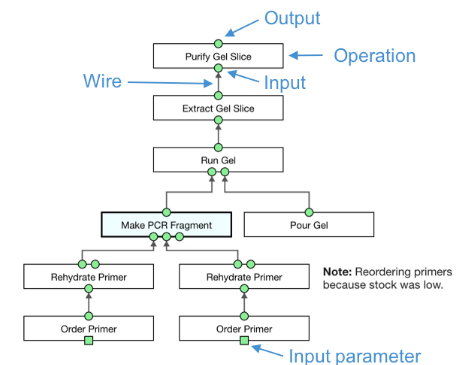

# PEG call graph format

PEGs are inspired by [call graphs](https://en.wikipedia.org/wiki/Call_graph), which represent the execution flow of a computation over input arguments. These structures are also used to represent the execution of biology procedures, such as in the [Aquarium](https://www.aquarium.bio/) wet lab experiment management system (below).

Example Aquarium experimental workflow (source: [https://www.aquarium.bio/](https://www.aquarium.bio/))

The example shows the three main components of executable protocol call graphs:

1. Operation nodes (white)
2. Argument nodes (green)
3. Routing information (edges)

 PEGs follow this convention, as we describe below.

# Nodes

See [code](definitions.py) for the specific fields recorded for each PEG node, and [types tree](types_tree.py) for the node types ontology.

## Operations and Events

In PEGs, the creation of every new relation (or relations) is technically an Event. An Event is any temporal occurrence that affects the process state, so all Events have an associated execution time-step (recorded during the annotator interaction with the simulator). 

The two kinds of events in our data are Operations and Implicit Events. 

### Operations

Operations are Events which are always associated by an explicit mention span in the text, like "Add" which usually triggers a `transfer` operation. 

**Operation Types**

- `default_op`: general label for operations not matching any of the fine-grained types.
- `transfer_op`: represents input arguments being transferred to a new location.
- `destroy_op`: represents inputs being discarded, after which they won't be used anymore in the process.
- `convert_op`: operations where one entity is converted to another, typically through some reaction.
- `create_op`: operation which provisions or prepares a new physical entity.
- `temp_treat_op`: represents an input argument being subject to thermal treatment, such as cooling or incubation.
- `spin_op`: treatment where materials are reacted by spinning at high speed. This often creates pellets (solid) and supernatant (liquid) which can play active roles in procedure.
- `measure_op`: represents various forms of measurement operations conducted as part of an experimental protocol, such as imaging and microscopy.
- `wash_op`: represents various forms of rinsing or other immersion in liquids. Applicable to entities as well as locations or devices.
- `seal_op`: operation which seals a container.
- `remove_op`: operations where an entity is removed from a mixture or container, for later processing.
- `time_op`: operation which involves simply waiting for a specified period of time, for example until a reaction is complete.
- `mix_op`: represents operations used to mix together various reactants.

See Table 3 in the [paper](https://arxiv.org/abs/2101.10244) for more details on type-specific operation semantics.

### Implicit Events

Besides operations, the second kind of event is called an implicit event. We use such events, since in call graphs, there are no argument-argument edges; arguments can only be input edges to events (or operations). So any predicate is also technically treated as an event, including binary predicates like  `measure_of`, where the temporal information may be meaningless. For example, in a phrase like "50 ml tube", "50 ml" is a related by a `measure_of` relation to "tube", so this relation holds throughout the process. For such predicates (`measure_of`, `setting_of`, `modifier_of`, `usage_of`), we default to ignoring the temporal information by automatically setting them to have occurred at the start of the process. Annotators could manually correct this if they deemed it was important.

For other predicates, the extra temporal information may be valuable. For example, in a sequence of instructions such as "Add the cells to a test tube with warm sea-water. Incubate cells at 60 degrees C." We would like to capture the co-reference of the 2nd sentence mention of "cells" with the composite entity created after sentence 1: the test tube with the cells and sea water. A co-reference link between "cells" (sent. 2) and "test tube" only makes sense in that particular temporal context.

**Implicit Event Types**

- `setting_of`: link a setting entity with the operation it is describing.
- `modifier_of`: links modifier to entity it is attempting to modify.
- `measure_of`: link that associates the various quantitative measures to a measured entity.
- `usage_of`: any entity that the action verb makes ‘use’ of is linked with this relation. Any entity that the action verb utilizes to perform the action.
- `located_at`: specify the location of a physical entity.
- `part_of`: sets some reagent, location or device entity to be a part of another reagent, location or device. For example, a "section" `location` entity may be part of a "tray" `location` entity.
- `co_ref_of`: links between an entity to another reference to it.

### Arguments (Entities)

Arguments in PEGs are also called entities, and represent either physical entities like "test tube" (`location` entity), or more abstract entities like measurements "37 degrees F" (`setting` entity).

**Physical Entity Types**

- `reagent`: substance or mixture for use in any kind of reaction, in preparing a product, because of its chemical or biological activity.
- `location`: containers for reagents or other physical entities. They lack any operation capabilities other than acting as a container.
- `device`: machine capable of acting as a container as well as performing a specific task on the objects that it holds
- `seal`: any kind of lid or enclosure for a location or device.

**Abstract Entities**

- `measurement`: typically used to provide measurement details of a reagent, device or location.
- `setting`: similar to measurement, but reserved specifically for operations - describes the conditions at which the operation takes place.
- `modifier`: word or a phrase that acts as an additional description of the entity it is modifying.
- `method`: word or phrase used to concisely define the procedure to be performed in association with the chosen action verb.

Note that the original WLP dataset uses a finer grained type ontology for entities. The focus of our work was on representation of process level information, so for simplicity we collapsed certain fine grained categories into more abstract higher level types. For example, the original WLP `speed`, `temperature` and `time` types are all `setting` type entities in X-WLP.

## Edges

Edges record the routing of arguments between various operations comprising the process. Edges either connect arguments to events, or between two events. Edges contain mapping information in the form of `(argument_type, argument)` pairs, such that for in incoming edge to an event `ev`, `(argument_type, argument)` denotes that `argument`  serves as an input to `ev` of type `argument_type`.

In the call grpah format, argument types are denoted by keys `a`, `b`, `c` corresponding to PropBank `ARG0`, `ARG1`, `ARG2`.
Further details of argument types and their syntax can be found in Appendix 3 of the paper. 

### PEG Connectivity

In order to enable straightforward conversion to AMR, we ensure each PEG is a single connected graph, even though in some cases the underlying annotated structure isn't connected. This may be due to incomplete annotation, or a reflection of the actual process. To ensure PEGs are connected without adding superfluous information, we simply add a "dummy" temporal ordering edge between the last and first operations of any two adjacent connected components. Dummy edges contain no argument routing information, and simply represent the assumption that unless specified otherwise, operations occur in the order mentioned in the text.
